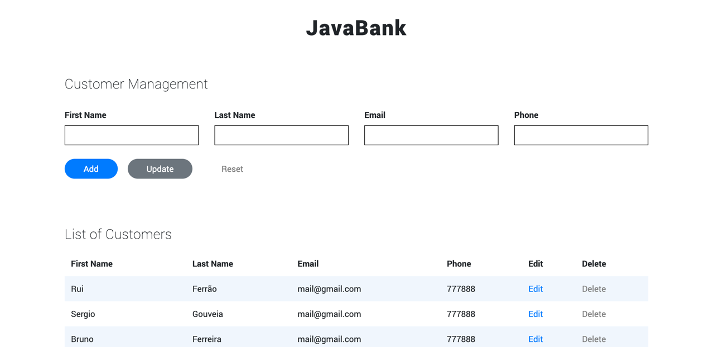

# api-with-ajax
In this project I use an API (a tomcat webapp) called javabank and manipulate that data through AJAX. 
It exchange data with a server (tomcat), and update parts of a responsive web page. 

I used HTML5, CSS3, Bootstrap, jQuery and Javascript. 

_This project was made during the bootcamp at Academia de Código._ 

